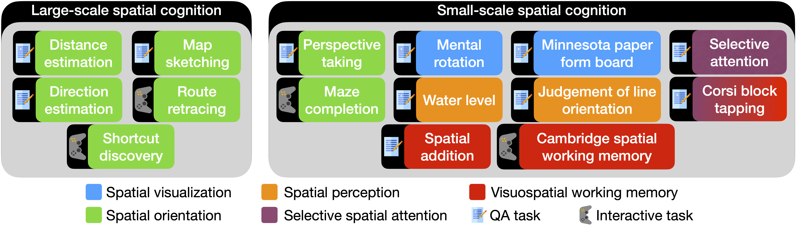

# SPACE benchmark

This software project and dataset accompanies the research paper: **[Does Spatial Cognition Emerge in Frontier Models?](https://arxiv.org/pdf/2410.06468)**, *Santhosh Kumar Ramakrishnan, Erik Wijmans, Philipp Krähenbühl, Vladlen Koltun*.
Published in ICLR 2025



We present SPACE, a benchmark that systematically evaluates spatial cognition in frontier models. Our benchmark builds on decades of research in cognitive science. It evaluates large-scale mapping abilities that are brought to bear when an organism traverses physical environments, smaller-scale reasoning about object shapes and layouts, and cognitive infrastructure such as spatial attention and memory. For many tasks, we instantiate parallel presentations via text and images, allowing us to benchmark both large language models and large multimodal models. Results suggest that contemporary frontier models fall short of the spatial intelligence of animals, performing near chance level on a number of classic tests of animal cognition.

## Installation instructions

1. Install mamba following instructions from [Miniforge](https://github.com/conda-forge/miniforge). Create a mamba environment.
    ```
    mamba create -n space-benchmark python=3.9 cmake=3.14.0 -y
    mamba activate space-benchmark
    ```
2. Clone this repo and install requirements.
    ```
    pip install -r requirements.txt
    ```
3. Install habitat for large-scale cognition navigation experiments.
    ```
    mamba install habitat-sim=0.3.0 headless -c conda-forge -c aihabitat
    ```
4. Generate a security token from huggingface and set the environment variables.
    ```
    export HF_TOKEN=<security token>
    export HF_HUB_ENABLE_HF_TRANSFER=1
    ```
5. Set OpenAI and Anthropic API keys for evaluating GPT and Claude models.
    ```
    export OPENAI_API_KEY=<openai api key>
    export ANTHROPIC_API_KEY=<anthropic api key>
    ```

## Downloading SPACE dataset
The SPACE dataset is available [here](https://ml-site.cdn-apple.com/datasets/space/space.tar.gz). Download it to `<repository_root>/data/SPACE_data_release`.
```
mkdir <repository_root>/data
cd <repository_root>/data

wget https://ml-site.cdn-apple.com/datasets/space/space.tar.gz
tar -xvzf space.tar.gz
rm space.tar.gz
```

## Evaluating models

### SPACE QA tasks
**Command:**
```
python -m space.evaluate_qas \
    --model_name <model_name>_qa \
    --data_path data/SPACE_data_release/<qa_task_name>/qas.json \
    --save_dir experiments/<qa_task_name>
```
**QA task names:** `CBTT_text`, `CBTT_vision`, `DirectionEstimationBEVImage`, `DirectionEstimationBEVText`, `DirectionEstimationEgo`, `DistanceEstimationBEVImage`, `DistanceEstimationBEVText`, `DistanceEstimationEgo`, `JLO_text`, `JLO_vision`, `MPFB_text`, `MPFB_vision`, `MRT_text`, `MRT_vision`, `MapSketchingBEVImage`, `MapSketchingBEVText`, `MapSketchingEgo`, `PTT_text`, `PTT_vision`, `SAdd_text`, `SAdd_vision`, `SAtt_text`, `SAtt_vision`, `WLT_vision` </br>
**Models supported for multimodal presentation:** `claude35sonnet`, `gpt4o`, `gpt4v`, `phi35vision`, `pixtral12b`</br>
**Models supported for text-only presentation:** `claude35sonnet`, `gpt4o`, `gpt4v`, `llama3_8b`, `llama3_70b`, `mixtral8x7b`, `mixtral8x22b`, `mistral123b`, `yi15_9b`, `yi15_34b`</br>

### SPACE navigation tasks
This evaluation requires habitat-sim to be installed.</br>

**Command for egocentric navigation:**
```
python -m space.evaluate_egonav \
    --model_name <model_name>_egonav \
    --envs_dir data/SPACE_data_release/3D_scenes/ \
    --save_dir experiments/RouteRetracingEgo \
    --walkthrough_key shortestpath \
    --max_steps 250
```

**Command for discrete map image navigation:**
```
python -m space.evaluate_dmnav \
    --model_name <model_name>_dminav \
    --envs_dir data/SPACE_data_release/2D_scenes \
    --walkthroughs_dir data/SPACE_data_release/BEV_image_walkthroughs/ \
    --obs_type image \
    --save_dir experiments/RouteRetracingDiscreteMapImage \
    --walkthrough_key shortestpath
```

**Command for discrete map text navigation:**
```
python -m space.evaluate_dmnav \
    --model_name <model_name>_dmtnav \
    --envs_dir data/SPACE_data_release/2D_scenes \
    --walkthroughs_dir data/SPACE_data_release/BEV_text_walkthroughs/ \
    --obs_type text \
    --save_dir experiments/RouteRetracingDiscreteMapText \
    --walkthrough_key shortestpath
```

**Notes:**
* These commands evaluate on route retracing. Set `--walkthrough_key walkthrough` for evaluating on shortcut discovery.</br>
* Models supported for multimodal presentation: `claude35sonnet`, `gpt4o`, `gpt4v`</br>
* Models supported for text-only presentation: `claude35sonnet`, `gpt4o`, `gpt4v`, `llama3_8b`, `llama3_70b`, `mixtral8x7b`, `mixtral8x22b`, `mistral123b`, `yi15_9b`, `yi15_34b`

### SPACE CSWM task
**Command for multimodal presentation:**
```
python -m space.evaluate_cswm \
    --model_name <model_name>_cswm_vision \
    --envs_dir data/SPACE_data_release/CSWM_vision/ \
    --save_dir experiments/CSWM_vision \
    --game_mode vision
```
**Command for text-only presentation:**
```
python -m space.evaluate_cswm \
    --model_name <model_name>_cswm_text \
    --envs_dir data/SPACE_data_release/CSWM_text/ \
    --save_dir experiments/CSWM_text \
    --game_mode text
```
**Models supported for multimodal presentation:** `claude35sonnet`, `gpt4o`, `gpt4v`</br>
**Models supported for text-only presentation:** `claude35sonnet`, `gpt4o`, `gpt4v`, `llama3_8b`, `llama3_70b`, `mixtral8x7b`, `mixtral8x22b`, `mistral123b`, `yi15_9b`, `yi15_34b`

### SPACE maze completion task
**Command for multimodal presentation:**
```
python -m space.evaluate_mct \
    --model_name <model_name>_mct_vision \
    --envs_dir data/SPACE_data_release/MCT_vision/envs \
    --save_dir experiments/MCT_vision
```
**Command for text-only presentation:**
```
python -m space.evaluate_mct \
    --model_name <model_name>_mct_text \
    --envs_dir data/SPACE_data_release/MCT_text/envs \
    --save_dir experiments/MCT_text
```
**Models supported for multimodal presentation:** `claude35sonnet`, `gpt4o`, `gpt4v`</br>
**Models supported for text-only presentation:** `claude35sonnet`, `gpt4o`, `gpt4v`, `llama3_8b`, `llama3_70b`, `mixtral8x7b`, `mixtral8x22b`, `mistral123b`, `yi15_9b`, `yi15_34b`


## Citation
```
@inproceedings{ramakrishnan2025space,
  title={Does Spatial Cognition Emerge in Frontier Models?},
  author={Ramakrishnan, Santhosh Kumar and Wijmans, Erik and Kraehenbuehl, Philipp and Koltun, Vladlen},
  booktitle={International Conference on Learning Representations},
  year={2025},
  url={https://openreview.net/forum?id=WK6K1FMEQ1}
}
```

## License
This project's code is released under the Apple Sample Code License (see [LICENSE](LICENSE)). This project's data is released under the CC-BY-NC-ND license (see [LICENSE_DATA](LICENSE_DATA)).

## Acknowledgements
Our codebase is built using opensource contributions, please see [Acknowledgements](ACKNOWLEDGEMENTS.md) for more details.

Please check the paper for a complete list of references and datasets used in this work.
